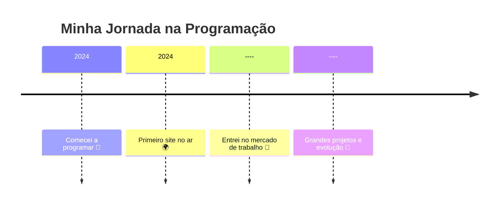

<!-- ============================== HEADER ============================== -->

  

  

  

---

<!-- ============================== SOBRE MIM ============================== -->
## 👋 Sobre mim

✨ Olá! Sou Ryan, apaixonado por tecnologia, desenvolvimento de software e criação de soluções que fazem a diferença.  
Gosto de trabalhar com FrontEnd principalmente e atualmente curso Desenvolvimento de Sistemas no SENAi.

- 🔭 Trabalhando em: EnerCheck
- 💬 Pergunte-me sobre: The Big Bang Theory
- ⚡ Fato curioso: Bazinga

---

<!-- ============================== GIF LATERAL ============================== -->

  

---

<!-- ============================== SKILLS ============================== -->
## 🧠 Tecnologias & Ferramentas

### 💻 Linguagens

  

### 🛠️ Frameworks & Ferramentas

  

### 🗄️ Banco de Dados

  

### ☁️ DevOps & Infra

  

---

<!-- ============================== ESTATÍSTICAS ============================== -->
## 📊 Minhas Estatísticas

  
  

  

---

<!-- ============================== PROJETOS ============================== -->
## 🚀 Projetos em Destaque

### ⭐ Projeto 1 — **Nome do Projeto**
> Descrição breve, bonita e impactante.
  
🔗 **Demo:** https://  
📦 **Repositório:** https://github.com/Brun0HM/EnerCheckPrincipal

---

<!-- ============================== BADGES ============================== -->
## 🏅 Badges & Certificações

  
  
  

---

<!-- ============================== TIMELINE ============================== -->
## 🕒 Linha do Tempo da Minha Jornada

## Me ajude a progredir em minha jornada! 🙏
